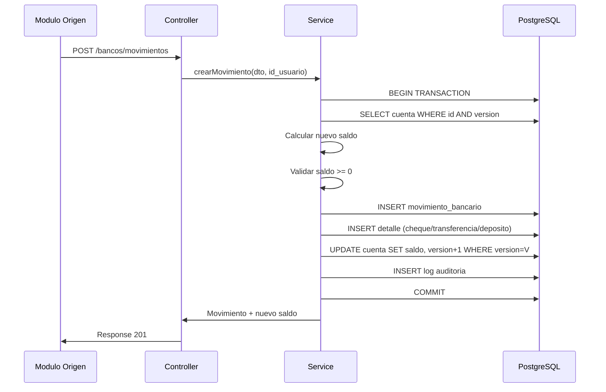

# Modulo de Bancos - Especificacion Tecnica

## 1. Especificacion Funcional

### 1.1 Objetivo
Proveer gestion centralizada de cuentas bancarias, movimientos financieros y control de saldos en tiempo real. Servir como nucleo financiero para otros modulos del sistema (ventas, compras, nomina, gastos).

### 1.2 Casos de Uso

**CU-01: Gestionar Cuentas Bancarias**
- Crear cuentas vinculadas a bancos del catalogo (`cat_banco`)
- Asignar tipo de cuenta (`cat_tipo_cuenta_banco`), sucursal y moneda
- Activar/desactivar cuentas (soft delete)
- Consultar saldo en tiempo real

**CU-02: Registrar Movimientos Bancarios**
- Registrar entradas (depositos, transferencias recibidas, notas de credito)
- Registrar salidas (cheques, transferencias enviadas, comisiones, notas de debito)
- Asociar detalles especificos segun metodo (cheque, transferencia, deposito)
- Calcular y persistir saldo resultante por movimiento

**CU-03: Ajustar Saldos**
- Ajustar saldo manualmente (positivo o negativo)
- Registrar motivo obligatorio
- Operar con misma logica transaccional que movimientos normales

**CU-04: Anular Movimientos**
- Anular movimiento existente con motivo obligatorio
- Crear movimiento de reversa automatico
- Mantener trazabilidad completa (movimiento original + reversa)

**CU-05: Consultar Historial**
- Filtrar por cuenta, tipo, metodo, modulo origen, fechas, estado
- Busqueda por referencia bancaria o descripcion
- Paginacion estandar del sistema

### 1.3 Flujo Principal



## 2. Diseno de Base de Datos

### 2.1 Enums

| Enum | Valores |
|------|---------|
| `tipo_movimiento_bancario` | ENTRADA, SALIDA, AJUSTE |
| `metodo_movimiento_bancario` | CHEQUE, TRANSFERENCIA, DEPOSITO, AJUSTE_MANUAL, NOTA_DEBITO, NOTA_CREDITO, COMISION_BANCARIA, INTERES |
| `modulo_origen_movimiento` | VENTAS, COMPRAS, NOMINA, GASTOS, MANUAL |
| `estado_movimiento_bancario` | ACTIVO, ANULADO |
| `estado_cheque` | EMITIDO, COBRADO, ANULADO |
| `tipo_deposito_bancario` | EFECTIVO, CHEQUE_TERCEROS |

### 2.2 Diagrama Entidad-Relacion

```mermaid
erDiagram
    cat_banco ||--o{ cuenta_bancaria : tiene
    cat_tipo_cuenta_banco ||--o{ cuenta_bancaria : tiene
    sucursales ||--o{ cuenta_bancaria : tiene
    usuarios ||--o{ cuenta_bancaria : crea
    cuenta_bancaria ||--o{ movimiento_bancario : tiene
    usuarios ||--o{ movimiento_bancario : registra
    usuarios ||--o{ movimiento_bancario : anula
    movimiento_bancario ||--o| cheque : detalle
    movimiento_bancario ||--o| transferencia_bancaria : detalle
    movimiento_bancario ||--o| deposito_bancario : detalle

    cuenta_bancaria {
        int id_cuenta_bancaria PK
        int id_banco FK
        int id_tipo_cuenta FK
        int id_sucursal FK
        int id_usuario_crea FK
        string numero_cuenta UK
        string alias
        string moneda
        decimal saldo_actual
        boolean permite_saldo_negativo
        datetime fecha_apertura
        enum estado
        int version
    }

    movimiento_bancario {
        int id_movimiento PK
        int id_cuenta_bancaria FK
        int id_usuario FK
        datetime fecha_movimiento
        enum tipo_movimiento
        enum metodo
        decimal monto
        decimal saldo_resultante
        string referencia_bancaria
        int documento_origen_id
        enum modulo_origen
        string descripcion
        enum estado_movimiento
        int id_usuario_anula FK
        string motivo_anulacion
        json metadata
    }

    cheque {
        int id_cheque PK
        int id_movimiento FK_UK
        string numero_cheque
        string beneficiario
        datetime fecha_emision
        datetime fecha_cobro
        enum estado_cheque
    }

    transferencia_bancaria {
        int id_transferencia PK
        int id_movimiento FK_UK
        string banco_contraparte
        string cuenta_contraparte
        string codigo_autorizacion
        datetime fecha_transferencia
    }

    deposito_bancario {
        int id_deposito PK
        int id_movimiento FK_UK
        enum tipo_deposito
        string numero_boleta
        datetime fecha_deposito
    }
```

### 2.3 Indices
- `cuenta_bancaria`: id_banco, estado
- `movimiento_bancario`: id_cuenta_bancaria, fecha_movimiento, tipo_movimiento, estado_movimiento, modulo_origen

## 3. Arquitectura API

### 3.1 Cuentas Bancarias

#### POST /bancos/cuentas-bancarias
```json
// Request
{
  "id_banco": 1,
  "id_tipo_cuenta": 1,
  "id_sucursal": 1,
  "numero_cuenta": "0001-1234-5678-9012",
  "alias": "Cuenta Principal",
  "moneda": "USD",
  "saldo_actual": 1000.00,
  "permite_saldo_negativo": false,
  "fecha_apertura": "2024-01-15"
}

// Response 201
{
  "id_cuenta_bancaria": 1,
  "numero_cuenta": "0001-1234-5678-9012",
  "alias": "Cuenta Principal",
  "saldo_actual": 1000.00,
  "banco": { "id_banco": 1, "nombre": "Banco Agricola" },
  "tipo_cuenta": { "id_tipo_cuenta": 1, "nombre": "Ahorro" }
}
```

#### GET /bancos/cuentas-bancarias?page=1&limit=10&id_banco=1&search=principal
```json
// Response 200
{
  "data": [...],
  "meta": { "total": 5, "page": 1, "limit": 10, "totalPages": 1 }
}
```

### 3.2 Movimientos Bancarios

#### POST /bancos/movimientos (Transferencia de salida)
```json
// Request
{
  "id_cuenta_bancaria": 1,
  "tipo_movimiento": "SALIDA",
  "metodo": "TRANSFERENCIA",
  "monto": 500.00,
  "referencia_bancaria": "TRF-2024-001",
  "modulo_origen": "COMPRAS",
  "documento_origen_id": 42,
  "descripcion": "Pago a proveedor XYZ",
  "transferencia": {
    "banco_contraparte": "Banco Cuscatlan",
    "cuenta_contraparte": "9876-5432-1098",
    "codigo_autorizacion": "AUTH-123",
    "fecha_transferencia": "2024-01-15"
  }
}

// Response 201
{
  "id_movimiento": 10,
  "tipo_movimiento": "SALIDA",
  "monto": 500.00,
  "saldo_resultante": 500.00,
  "cuenta_bancaria": {
    "id_cuenta_bancaria": 1,
    "numero_cuenta": "0001-1234-5678-9012",
    "saldo_actual": 500.00
  },
  "transferencia": {
    "banco_contraparte": "Banco Cuscatlan",
    "codigo_autorizacion": "AUTH-123"
  }
}
```

#### POST /bancos/movimientos (Cheque de salida)
```json
{
  "id_cuenta_bancaria": 1,
  "tipo_movimiento": "SALIDA",
  "metodo": "CHEQUE",
  "monto": 200.00,
  "descripcion": "Pago nomina enero",
  "cheque": {
    "numero_cheque": "CHQ-001",
    "beneficiario": "Juan Perez",
    "fecha_emision": "2024-01-15"
  }
}
```

#### PATCH /bancos/movimientos/:id/anular
```json
// Request
{ "motivo_anulacion": "Error en el monto registrado" }

// Response 200 - Retorna el movimiento de reversa creado
{
  "id_movimiento": 11,
  "tipo_movimiento": "ENTRADA",
  "descripcion": "Reversa del movimiento #10: Error en el monto registrado",
  "saldo_resultante": 1000.00
}
```

#### POST /bancos/movimientos/cuentas/:id/ajuste
```json
// Request
{
  "monto": -15.50,
  "descripcion": "Comision bancaria no registrada",
  "referencia_bancaria": "ADJ-2024-001"
}
```

## 4. Reglas de Negocio

### 4.1 Calculo de Saldos
| Tipo | Formula |
|------|---------|
| ENTRADA | saldo_actual + monto |
| SALIDA | saldo_actual - monto |
| AJUSTE | saldo_actual + monto (monto puede ser negativo) |

### 4.2 Validaciones
- Monto > 0 para movimientos normales
- Monto != 0 para ajustes
- Cuenta debe estar ACTIVA
- Saldo resultante >= 0 (si permite_saldo_negativo = false)
- Metodo CHEQUE requiere detalle de cheque
- Metodo TRANSFERENCIA requiere detalle de transferencia
- Metodo DEPOSITO requiere detalle de deposito

### 4.3 Concurrencia (Optimistic Locking)
1. Leer `version` de la cuenta
2. Calcular nuevo saldo
3. UPDATE ... WHERE id = X AND version = V → SET version = V + 1
4. Si updateMany.count === 0 → ConflictException (409)

### 4.4 Anulacion
1. Validar movimiento ACTIVO
2. Marcar como ANULADO con motivo y fecha
3. Crear movimiento de reversa (tipo contrario, mismo monto)
4. Actualizar saldo de la cuenta
5. Todo dentro de $transaction

## 5. Guia de Integracion

### Desde Modulo de Compras
```typescript
// Inyectar MovimientosBancariosService
const movimiento = await this.movimientosBancariosService.crearMovimiento({
  id_cuenta_bancaria: cuentaSeleccionada,
  tipo_movimiento: 'SALIDA',
  metodo: 'TRANSFERENCIA',
  monto: totalCompra,
  modulo_origen: 'COMPRAS',
  documento_origen_id: compra.id_compra,
  descripcion: `Pago compra #${compra.id_compra}`,
  transferencia: { ... }
}, id_usuario);
```

### Desde Modulo de Ventas
```typescript
const movimiento = await this.movimientosBancariosService.crearMovimiento({
  id_cuenta_bancaria: cuentaEmpresa,
  tipo_movimiento: 'ENTRADA',
  metodo: 'DEPOSITO',
  monto: totalVenta,
  modulo_origen: 'VENTAS',
  documento_origen_id: venta.id_venta,
  descripcion: `Cobro venta #${venta.id_venta}`,
  deposito: { ... }
}, id_usuario);
```

## 6. Seguridad

### Permisos (9 totales)
| Codigo | Tipo | Critico | Auditoria |
|--------|------|---------|-----------|
| `bancos.cuentas:ver` | RECURSO | No | No |
| `bancos.cuentas:crear` | RECURSO | No | Si |
| `bancos.cuentas:editar` | RECURSO | No | Si |
| `bancos.cuentas:eliminar` | RECURSO | Si | Si |
| `bancos.movimientos:ver` | RECURSO | No | No |
| `bancos.movimientos:crear` | RECURSO | No | Si |
| `bancos.movimientos:anular` | CUSTOM | Si | Si |
| `bancos.movimientos:ajustar` | CUSTOM | Si | Si |
| `bancos.movimientos:exportar` | RECURSO | No | No |

### Acciones Criticas
- Anular movimientos: Requiere permiso especifico, genera reversa automatica
- Ajustar saldos: Requiere permiso especifico, motivo obligatorio
- Desactivar cuentas: Accion irreversible en flujo normal

## 7. Plan de Pruebas

### Unitarios (Services)
- Crear cuenta bancaria con datos validos
- Rechazar cuenta con numero duplicado
- Crear movimiento ENTRADA y verificar saldo
- Crear movimiento SALIDA y verificar saldo
- Rechazar SALIDA con saldo insuficiente
- Permitir saldo negativo si permite_saldo_negativo = true
- Ajuste positivo y negativo
- Anular movimiento y verificar reversa de saldo
- Rechazar anulacion de movimiento ya anulado
- Optimistic locking: ConflictException en version mismatch

### Integracion (Controllers)
- CRUD completo de cuentas bancarias
- Flujo: crear cuenta → deposito → transferencia salida → consultar saldo
- Flujo: crear movimiento → anular → verificar saldo revertido
- Paginacion y filtros de movimientos
- Permisos: acceso denegado sin permiso correcto
