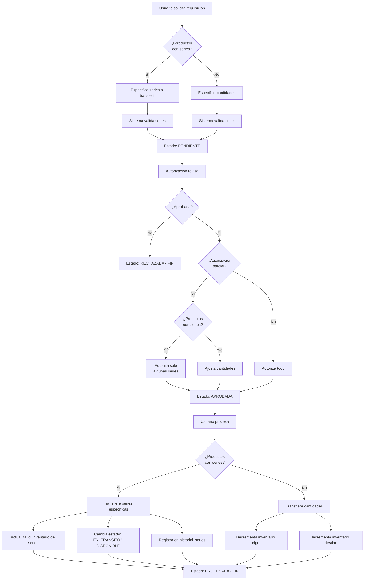

# Módulo de Requisiciones de Inventario

Este módulo gestiona las requisiciones de inventario, permitiendo transferencias de productos entre bodegas, sucursales y estantes. **Soporta tanto productos regulares (por cantidad) como productos serializados (con número de serie y MAC address)**.

## Índice

- [Características](#características)
- [Flujo de Requisiciones](#flujo-de-requisiciones)
- [Tipos de Requisición](#tipos-de-requisición)
- [Estados de Requisición](#estados-de-requisición)
- [Manejo de Productos Serializados](#manejo-de-productos-serializados)
- [Endpoints API](#endpoints-api)
- [Ejemplos de Uso](#ejemplos-de-uso)

## Características

-  Tres tipos de transferencia: entre bodegas, entre sucursales, y cambio de estante
-  Flujo de aprobación: solicitud ’ autorización ’ procesamiento
-  Soporte completo para productos serializados (ONUs, routers, switches, etc.)
-  Validación de disponibilidad de stock y series
-  Autorización parcial de cantidades y series
-  Generación automática de códigos (formato: REQ-YYYYMM-#####)
-  Historial completo de movimientos de series
-  Auditoría de acciones (log de sistema)
-  Generación de PDF de requisiciones

## Flujo de Requisiciones



## Tipos de Requisición

### 1. TRANSFERENCIA_BODEGA
Mueve inventario entre bodegas (pueden estar en diferentes sucursales o en la misma).

**Campos requeridos:**
- `id_bodega_origen`
- `id_bodega_destino`

**Ejemplo:**
```json
{
  "tipo": "TRANSFERENCIA_BODEGA",
  "id_bodega_origen": 1,
  "id_bodega_destino": 2,
  "motivo": "Reabastecimiento de bodega secundaria",
  "detalle": [...]
}
```

### 2. TRANSFERENCIA_SUCURSAL
Mueve inventario entre las bodegas principales de dos sucursales.

**Campos requeridos:**
- `id_sucursal_origen`
- `id_sucursal_destino`

**Ejemplo:**
```json
{
  "tipo": "TRANSFERENCIA_SUCURSAL",
  "id_sucursal_origen": 1,
  "id_sucursal_destino": 2,
  "motivo": "Redistribución de stock entre sucursales",
  "detalle": [...]
}
```

### 3. CAMBIO_ESTANTE
Mueve inventario entre estantes dentro de la misma bodega.

**Campos requeridos:**
- `id_bodega_origen`
- `id_estante_origen`
- `id_estante_destino`

**Ejemplo:**
```json
{
  "tipo": "CAMBIO_ESTANTE",
  "id_bodega_origen": 1,
  "id_estante_origen": 3,
  "id_estante_destino": 5,
  "motivo": "Reorganización de bodega",
  "detalle": [...]
}
```

## Estados de Requisición

| Estado | Descripción |
|--------|-------------|
| **PENDIENTE** | Requisición creada, esperando autorización |
| **APROBADA** | Autorizada, lista para ser procesada |
| **RECHAZADA** | Rechazada por el autorizador |
| **PROCESADA** | Transferencia completada exitosamente |
| **CANCELADA** | Cancelada manualmente (solo si no está procesada) |

## Manejo de Productos Serializados

### ¿Qué son productos serializados?

Productos serializados son aquellos que requieren control individual por número de serie y/o MAC address, como:
- ONUs (Optical Network Units)
- Routers
- Switches
- Access Points
- Modems

### Creación de Requisición con Series

Cuando un producto tiene `tiene_serie: true` en el catálogo, puedes especificar las series exactas a transferir:

```json
{
  "tipo": "TRANSFERENCIA_BODEGA",
  "id_bodega_origen": 1,
  "id_bodega_destino": 2,
  "motivo": "Transferencia de ONUs para instalaciones",
  "detalle": [
    {
      "id_catalogo": 42,
      "cantidad_solicitada": 3,
      "series": [101, 102, 103],  // IDs de inventario_series
      "observaciones": "ONUs para zona norte"
    }
  ]
}
```

**Validaciones automáticas:**
-  Las series existen en la base de datos
-  Las series pertenecen al producto solicitado
-  Las series están en estado `DISPONIBLE`
-  Las series están en la bodega/estante origen especificado
-  La cantidad solicitada coincide con el número de series

### Autorización de Series

El autorizador puede aprobar solo algunas de las series solicitadas:

```json
{
  "aprobar": true,
  "observaciones_autorizacion": "Se autorizan solo 2 de las 3 ONUs solicitadas",
  "detalle": [
    {
      "id_requisicion_detalle": 1,
      "cantidad_autorizada": 2,
      "series_autorizadas": [101, 102]  // Solo estas dos series
    }
  ]
}
```

Si no se especifica `series_autorizadas`, se aprueban todas las series solicitadas.

### Procesamiento de Series

Durante el procesamiento, el sistema:

1. **Actualiza el inventario de cada serie:**
   - Cambia `id_inventario` al inventario destino
   - Cambia estado: `DISPONIBLE` ’ `EN_TRANSITO` ’ `DISPONIBLE`

2. **Registra historial completo:**
   ```sql
   historial_series:
   - estado_anterior: DISPONIBLE
   - estado_nuevo: EN_TRANSITO
   - id_bodega_anterior: 1
   - id_bodega_nueva: 2
   - observaciones: "Transferencia por requisición REQ-202501-00001"
   ```

3. **Actualiza cantidades agregadas:**
   - Decrementa `cantidad_disponible` en inventario origen
   - Incrementa `cantidad_disponible` en inventario destino

4. **Registra movimiento:**
   ```sql
   movimientos_inventario:
   - tipo: TRANSFERENCIA
   - cantidad: 2
   - observaciones: "Requisición REQ-202501-00001 - 2 series transferidas"
   ```

## Endpoints API

### POST `/inventario/requisiciones`
Crea una nueva requisición.

**Request Body:**
```json
{
  "tipo": "TRANSFERENCIA_BODEGA",
  "id_bodega_origen": 1,
  "id_bodega_destino": 2,
  "motivo": "Reabastecimiento",
  "detalle": [
    {
      "id_catalogo": 5,
      "cantidad_solicitada": 10,
      "series": [1, 2, 3],  // Opcional, solo para productos serializados
      "observaciones": "Urgente"
    }
  ]
}
```

**Response:** Requisición creada con estado `PENDIENTE`

---

### GET `/inventario/requisiciones`
Lista todas las requisiciones con paginación y filtros.

**Query Params:**
- `page`: Número de página (default: 1)
- `limit`: Items por página (default: 10)
- `search`: Buscar por código o motivo
- `estado`: Filtrar por estado (PENDIENTE, APROBADA, etc.)
- `tipo`: Filtrar por tipo
- `id_usuario_solicita`: Filtrar por usuario solicitante

---

### GET `/inventario/requisiciones/:id`
Obtiene una requisición específica con todos sus detalles, incluyendo series.

---

### PUT `/inventario/requisiciones/:id`
Actualiza una requisición en estado `PENDIENTE`.

---

### PATCH `/inventario/requisiciones/:id/autorizar`
Autoriza o rechaza una requisición.

**Request Body:**
```json
{
  "aprobar": true,
  "observaciones_autorizacion": "Aprobada con ajustes",
  "detalle": [
    {
      "id_requisicion_detalle": 1,
      "cantidad_autorizada": 8,
      "series_autorizadas": [1, 2, 3, 4, 5, 6, 7, 8]  // Opcional
    }
  ]
}
```

**Response:** Requisición con estado `APROBADA` o `RECHAZADA`

---

### PATCH `/inventario/requisiciones/:id/procesar`
Procesa una requisición aprobada (ejecuta la transferencia física de inventario).

**Request Body:**
```json
{
  "observaciones_proceso": "Transferencia completada sin novedades"
}
```

**Response:** Requisición con estado `PROCESADA`

---

### PATCH `/inventario/requisiciones/:id/cancelar`
Cancela una requisición que no ha sido procesada.

---

### GET `/inventario/requisiciones/:id/pdf`
Genera un PDF de la requisición.

**Response:** Archivo PDF

---

### DELETE `/inventario/requisiciones/:id`
Elimina (cancela) una requisición no procesada.

## Ejemplos de Uso

### Ejemplo 1: Requisición de productos regulares (sin series)

```bash
POST /inventario/requisiciones
{
  "tipo": "TRANSFERENCIA_BODEGA",
  "id_bodega_origen": 1,
  "id_bodega_destino": 3,
  "motivo": "Reabastecimiento mensual",
  "detalle": [
    {
      "id_catalogo": 10,
      "cantidad_solicitada": 50,
      "observaciones": "Cable UTP Cat6"
    },
    {
      "id_catalogo": 15,
      "cantidad_solicitada": 100,
      "observaciones": "Conectores RJ45"
    }
  ]
}
```

### Ejemplo 2: Requisición de ONUs (productos serializados)

```bash
POST /inventario/requisiciones
{
  "tipo": "TRANSFERENCIA_BODEGA",
  "id_bodega_origen": 1,
  "id_bodega_destino": 2,
  "motivo": "ONUs para instalaciones zona este",
  "detalle": [
    {
      "id_catalogo": 42,
      "cantidad_solicitada": 5,
      "series": [201, 202, 203, 204, 205],
      "observaciones": "ONUs Huawei HG8546M"
    }
  ]
}
```

### Ejemplo 3: Autorización parcial de series

```bash
PATCH /inventario/requisiciones/15/autorizar
{
  "aprobar": true,
  "observaciones_autorizacion": "Solo se autorizan 3 ONUs de las 5 solicitadas",
  "detalle": [
    {
      "id_requisicion_detalle": 1,
      "cantidad_autorizada": 3,
      "series_autorizadas": [201, 202, 203]
    }
  ]
}
```

### Ejemplo 4: Procesamiento de requisición

```bash
PATCH /inventario/requisiciones/15/procesar
{
  "observaciones_proceso": "Transferencia completada. ONUs empacadas y despachadas."
}
```

## Estructura de Base de Datos

### Tabla `requisiciones_inventario`
Almacena la requisición principal con origen, destino y estados.

### Tabla `requisiciones_detalle`
Almacena cada item/producto de la requisición con cantidades solicitadas, autorizadas y procesadas.

### Tabla `requisiciones_detalle_series` (Nueva)
Relaciona cada detalle con las series específicas que se van a transferir.

**Relaciones:**
```
requisiciones_inventario (1) 
                                (N) requisiciones_detalle (1) 
                                                                  (N) requisiciones_detalle_series  (1) inventario_series
                                usuarios (solicita, autoriza, procesa)
                                bodegas, sucursales, estantes
```

## Seguridad y Validaciones

- **Autenticación:** Todos los endpoints requieren JWT token válido
- **Autorización:** Los usuarios deben tener permisos adecuados
- **Validación de Stock:** Se verifica disponibilidad antes de procesar
- **Validación de Series:** Se verifica estado DISPONIBLE y ubicación correcta
- **Auditoría:** Todos los cambios se registran en el log del sistema
- **Historial de Series:** Cada cambio de serie se registra en `historial_series`

## Notas Importantes

1. **Productos Serializados:**
   - Si un producto tiene series, DEBE especificar los IDs de series exactas
   - La cantidad solicitada debe coincidir con el número de series
   - No se pueden mezclar transferencias con y sin series en el mismo item

2. **Estados de Series:**
   - Durante la transferencia, las series pasan temporalmente a estado `EN_TRANSITO`
   - Al completarse, vuelven a `DISPONIBLE` en la nueva ubicación
   - El historial completo se mantiene en `historial_series`

3. **Cancelación:**
   - Solo se pueden cancelar requisiciones NO procesadas
   - Las requisiciones procesadas son permanentes (se requeriría una requisición inversa)

4. **Autorización Parcial:**
   - Se puede autorizar menos cantidad de la solicitada
   - Para series, se pueden autorizar solo algunas de las series solicitadas
   - Las series no autorizadas se eliminan automáticamente del detalle

## Mantenimiento y Troubleshooting

### Verificar Series Disponibles
```sql
SELECT * FROM inventario_series
WHERE id_inventario IN (
  SELECT id_inventario FROM inventario
  WHERE id_bodega = 1 AND id_catalogo = 42
)
AND estado = 'DISPONIBLE';
```

### Ver Historial de una Serie
```sql
SELECT * FROM historial_series
WHERE id_serie = 201
ORDER BY fecha_movimiento DESC;
```

### Requisiciones Pendientes de Autorización
```bash
GET /inventario/requisiciones?estado=PENDIENTE
```

### Generar Reporte PDF
```bash
GET /inventario/requisiciones/15/pdf
```
