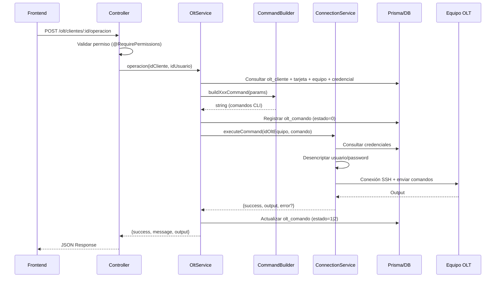
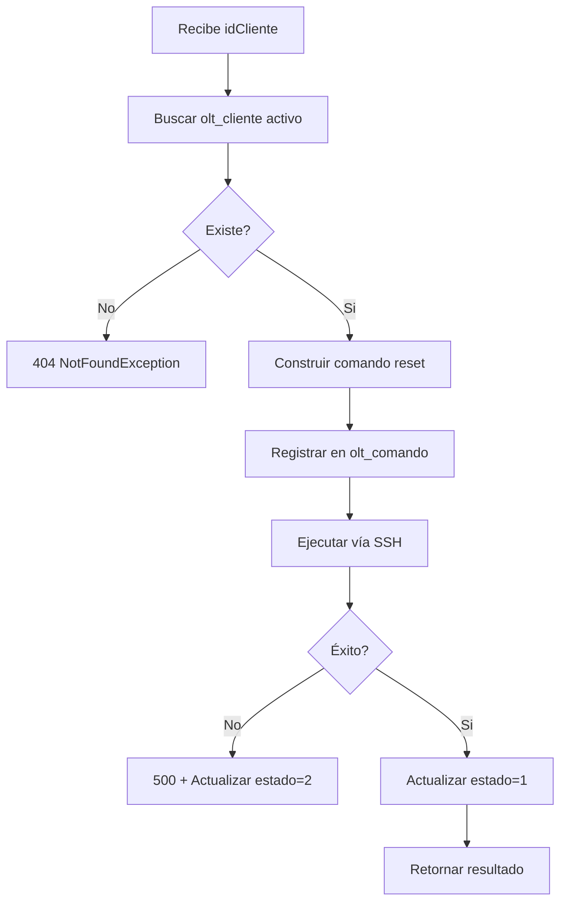
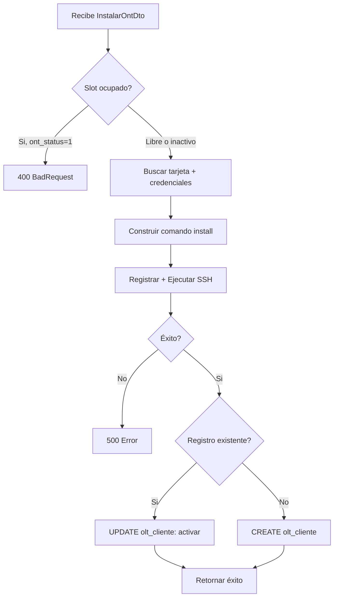
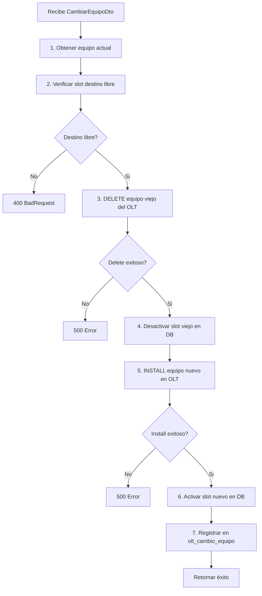
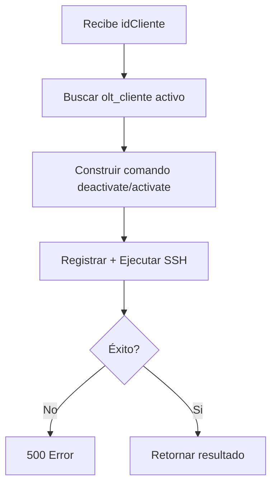
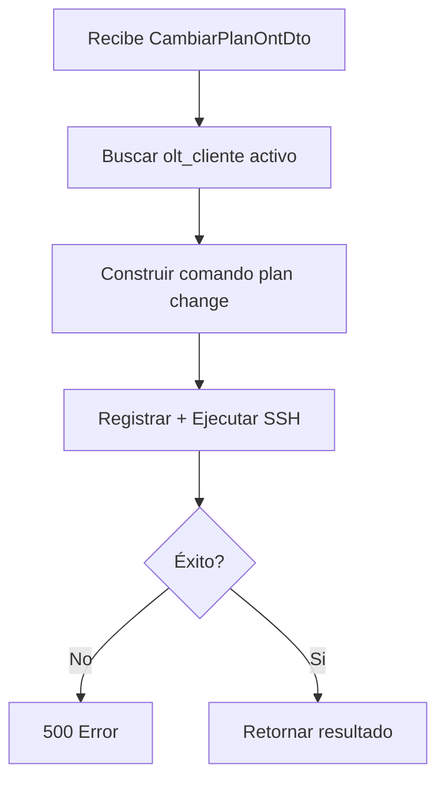

# Módulo OLT/ONT - Gestión de Equipos GPON

## 1. Descripción General

Este módulo gestiona la infraestructura GPON/FTTH de la red, permitiendo operar equipos OLT (Optical Line Terminal) y ONT (Optical Network Terminal) de clientes mediante comandos Huawei ejecutados vía SSH.

**Reemplaza**: Los scripts PHP legacy (`gestionOLT.php`, `aplicarReinicio.php`, `getServicePortOntID.php`) que usaban Telnet y un ejecutable C++ para enviar comandos.

**Mejoras respecto al sistema legacy**:
- SSH en lugar de Telnet (cifrado en tránsito)
- Credenciales encriptadas con AES-256-GCM (en reposo)
- Auditoría completa de cada comando ejecutado
- Permisos granulares por operación
- Validación de datos con DTOs antes de ejecutar

## 2. Arquitectura del Módulo

```
afis-bk/src/modules/olt/
├── dto/
│   ├── activar-ont.dto.ts          # DTO para activar ONT
│   ├── cambiar-equipo.dto.ts       # DTO para cambio de equipo
│   ├── cambiar-plan-ont.dto.ts     # DTO para cambio de plan de tráfico
│   ├── instalar-ont.dto.ts         # DTO para instalación nueva
│   ├── query-ont-status.dto.ts     # DTO para consulta de estado
│   ├── reset-ont.dto.ts            # DTO para reinicio
│   └── suspender-ont.dto.ts        # DTO para suspensión
├── interfaces/
│   └── olt-command.interface.ts     # Interfaces compartidas
├── olt-command-builder.service.ts   # Genera comandos CLI Huawei
├── olt-connection.service.ts        # Conexión SSH + encriptación
├── olt.controller.ts                # Endpoints REST
├── olt.module.ts                    # Módulo NestJS
└── olt.service.ts                   # Lógica de negocio principal
```

### Responsabilidades

| Archivo | Responsabilidad |
|---------|----------------|
| `olt.controller.ts` | Recibe HTTP requests, valida permisos, delega al service |
| `olt.service.ts` | Orquesta: consulta DB → genera comando → ejecuta SSH → registra resultado |
| `olt-command-builder.service.ts` | Genera strings de comandos CLI Huawei según la operación |
| `olt-connection.service.ts` | Maneja conexión SSH, encripta/desencripta credenciales |

### Dependencias del módulo

```typescript
imports: [AuthModule, PrismaModule, ConfigModule]
exports: [OltService]  // Disponible para otros módulos
```

## 3. Modelo de Datos

### Diagrama de Relaciones

```
olt_equipo ─1:N─ olt_tarjeta ─1:N─ olt_cliente ─N:1─ cliente
    │                                      │
    ├─1:1─ olt_credencial                  ├─N:1─ olt_modelo ─N:1─ olt_marca
    │                                      │
    └─1:N─ olt_comando ─N:1─ usuarios     olt_cambio_equipo ─N:1─ usuarios

olt_red ─1:N─ olt_cliente_ip ─N:1─ cliente

olt_perfil_trafico (tabla independiente de perfiles de velocidad)
olt_cliente_telefono ─N:1─ cliente
```

### Tablas de Infraestructura (pre-existentes, datos migrados)

#### `olt_equipo` - Equipos OLT físicos
| Campo | Tipo | Descripción |
|-------|------|-------------|
| `id_olt_equipo` | Int (PK, auto) | ID del equipo |
| `nombre` | VarChar(50) | Nombre identificador (ej: "OLT1-Newtel") |
| `ip_address` | VarChar(50) | IP de gestión del equipo |
| `id_sucursal` | Int? (FK) | Sucursal donde está ubicado |
| `legacy_id` | Int? (unique) | ID del sistema legacy |

#### `olt_marca` - Marcas de equipos ONT
| Campo | Tipo | Descripción |
|-------|------|-------------|
| `id_olt_marca` | Int (PK, auto) | ID de la marca |
| `nombre` | VarChar(25) | Nombre (ej: "Huawei", "ZTE") |

#### `olt_modelo` - Modelos de ONT
| Campo | Tipo | Descripción |
|-------|------|-------------|
| `id_olt_modelo` | Int (PK, auto) | ID del modelo |
| `id_olt_marca` | Int (FK) | Marca del modelo |
| `nombre` | VarChar(20) | Nombre del modelo |
| `srvprofile_olt` | VarChar(45)? | ID del perfil de servicio en OLT |

#### `olt_tarjeta` - Tarjetas/slots en equipos OLT
| Campo | Tipo | Descripción |
|-------|------|-------------|
| `id_olt_tarjeta` | Int (PK, auto) | ID de la tarjeta |
| `id_olt_equipo` | Int (FK) | Equipo OLT al que pertenece |
| `nombre` | VarChar(50) | Nombre descriptivo |
| `slot` | Int | Número de slot físico |
| `modelo` | VarChar(50)? | Modelo de tarjeta |

#### `olt_cliente` - Asignación ONT↔Cliente
| Campo | Tipo | Descripción |
|-------|------|-------------|
| `id_olt_cliente` | Int (PK, auto) | ID de asignación |
| `id_cliente` | Int? (FK) | Cliente asignado (null = slot libre) |
| `id_olt_tarjeta` | Int (FK) | Tarjeta donde está conectado |
| `port` | Int | Puerto en la tarjeta |
| `ont` | Int | ONT ID (0-127) |
| `ont_status` | Int (default: 0) | **0** = inactivo, **1** = activo |
| `serviceport` | Int | Service port asignado |
| `serviceport_status` | Int (default: 0) | **0** = inactivo, **1** = activo |
| `id_olt_modelo` | Int? (FK) | Modelo de ONT instalado |
| `sn` | VarChar(30)? | Serial Number del ONT |
| `password` | VarChar(15)? | Password LOID del ONT |
| `vlan` | Int? | VLAN asignada |
| `user_vlan` | Int? | User VLAN |
| `fecha_activacion` | DateTime? | Fecha de última activación |
| `serviceport_tr069` | Int? | Service port TR-069 |
| `serviceport_iptv` | Int? | Service port IPTV |
| `serviceport_voip` | Int? | Service port VoIP |

**Índices**: `id_cliente`, `serviceport`

#### `olt_cliente_ip` - IPs asignadas a clientes
| Campo | Tipo | Descripción |
|-------|------|-------------|
| `id_olt_cliente_ip` | Int (PK, auto) | ID |
| `id_cliente` | Int? (FK) | Cliente |
| `id_olt_red` | Int (FK) | Red a la que pertenece |
| `ip` | VarChar(15) | Dirección IP |
| `long_code` | BigInt? | IP en formato numérico |
| `selected_pri_dns` | VarChar(15)? | DNS primario |
| `selected_slv_dns` | VarChar(15)? | DNS secundario |
| `is_reserved` | Boolean (default: false) | Si la IP está reservada |

#### `olt_red` - Redes/subnets
| Campo | Tipo | Descripción |
|-------|------|-------------|
| `id_olt_red` | Int (PK, auto) | ID |
| `network` | VarChar(15) | Dirección de red |
| `netmask` | VarChar(15) | Máscara |
| `cidr` | Int | Notación CIDR |
| `gateway` | VarChar(15) | Gateway |
| `pri_dns` / `slv_dns` | VarChar(15)? | DNS por defecto |
| `proposito` | VarChar(255)? | Descripción del uso |

#### `olt_perfil_trafico` - Perfiles de velocidad
| Campo | Tipo | Descripción |
|-------|------|-------------|
| `id_olt_perfil_trafico` | Int (PK, auto) | ID |
| `nombre` | VarChar(30) | Nombre (ej: "10M", "50M") |
| `cir` | Int | Committed Information Rate |
| `cbs` | Int | Committed Burst Size |
| `pir` | Int | Peak Information Rate |
| `pbs` | Int | Peak Burst Size |

#### `olt_cliente_telefono` - Telefonía VoIP
| Campo | Tipo | Descripción |
|-------|------|-------------|
| `id_olt_cliente_telefono` | Int (PK, auto) | ID |
| `id_cliente` | Int (FK) | Cliente |
| `extension` / `telefono` / `usuario` / `password` | VarChar(45)? | Datos VoIP |

### Tablas Nuevas (creadas por este módulo)

#### `olt_credencial` - Credenciales SSH encriptadas
| Campo | Tipo | Descripción |
|-------|------|-------------|
| `id_olt_credencial` | Int (PK, auto) | ID |
| `id_olt_equipo` | Int (FK, **unique**) | Equipo OLT (relación 1:1) |
| `ssh_usuario` | VarChar(100) | Usuario SSH **encriptado** (AES-256-GCM) |
| `ssh_password` | VarChar(255) | Password SSH **encriptado** (AES-256-GCM) |
| `ssh_puerto` | Int (default: 22) | Puerto SSH |
| `prompt_pattern` | VarChar(100) (default: "OLT1-Newtel>") | Patrón del prompt CLI |

#### `olt_comando` - Log de comandos ejecutados
| Campo | Tipo | Descripción |
|-------|------|-------------|
| `id_olt_comando` | Int (PK, auto) | ID |
| `id_olt_equipo` | Int (FK) | Equipo donde se ejecutó |
| `id_cliente` | Int? (FK) | Cliente afectado |
| `tipo_operacion` | VarChar(30) | Tipo: `RESET`, `INSTALL`, `DEACTIVATE`, `ACTIVATE`, `DELETE`, `EQUIPMENT_CHANGE`, `PLAN_CHANGE` |
| `comando` | Text | Comando completo enviado |
| `estado` | Int (default: 0) | **0** = pendiente, **1** = éxito, **2** = error |
| `respuesta` | Text? | Output del equipo |
| `error_mensaje` | Text? | Mensaje de error si falló |
| `id_usuario` | Int (FK) | Usuario que ejecutó |
| `createdAt` | DateTime | Fecha de creación |
| `ejecutadoAt` | DateTime? | Fecha de ejecución |

**Índices**: `estado`, `id_cliente`

#### `olt_cambio_equipo` - Historial de cambios de equipo
| Campo | Tipo | Descripción |
|-------|------|-------------|
| `id_olt_cambio_equipo` | Int (PK, auto) | ID |
| `id_cliente` | Int (FK) | Cliente |
| `sn_anterior` / `sn_nuevo` | VarChar(30)? | Serial numbers |
| `password_anterior` / `password_nuevo` | VarChar(15)? | Passwords LOID |
| `id_modelo_anterior` / `id_modelo_nuevo` | Int? | Modelos de ONT |
| `observacion` | Text? | Nota del técnico |
| `id_usuario` | Int (FK) | Usuario que realizó el cambio |
| `createdAt` | DateTime | Fecha del cambio |

**Índice**: `id_cliente`

## 4. API REST - Referencia de Endpoints

Base URL: `/olt`

Todos los endpoints requieren autenticación JWT (`@Auth()`).

### Tabla resumen

| Método | Ruta | Permiso | Descripción |
|--------|------|---------|-------------|
| `POST` | `/olt/clientes/:idCliente/reset` | `olt.gestion:reiniciar` | Reiniciar ONT |
| `GET` | `/olt/clientes/:idCliente/wan-info` | `olt.gestion:consultar` | Info WAN (IP asignada) |
| `GET` | `/olt/clientes/:idCliente/info` | `olt.gestion:consultar` | Config OLT del cliente |
| `POST` | `/olt/clientes/:idCliente/instalar` | `olt.gestion:instalar` | Instalar ONT nuevo |
| `POST` | `/olt/clientes/:idCliente/suspender` | `olt.gestion:suspender` | Suspender servicio |
| `POST` | `/olt/clientes/:idCliente/activar` | `olt.gestion:activar` | Reactivar servicio |
| `POST` | `/olt/clientes/:idCliente/cambiar-equipo` | `olt.gestion:cambiar_equipo` | Cambiar equipo ONT |
| `POST` | `/olt/clientes/:idCliente/cambiar-plan` | `olt.gestion:cambiar_plan` | Cambiar plan de tráfico |
| `GET` | `/olt/clientes/:idCliente/historial` | `olt.gestion:consultar` | Historial de comandos |
| `GET` | `/olt/clientes/:idCliente/cambios-equipo` | `olt.gestion:consultar` | Historial cambios equipo |
| `GET` | `/olt/disponibles/:idTarjeta/:port` | `olt.gestion:consultar` | ONT IDs y service ports libres |

### Detalle de Endpoints

#### POST `/olt/clientes/:idCliente/reset`

Reinicia el ONT del cliente enviando `ont reset` al equipo OLT.

**Parámetros URL**: `idCliente` (int)

**Body**: ninguno

**Respuesta exitosa** (200):
```json
{
  "success": true,
  "message": "ONT reiniciado exitosamente (Slot 1, Puerto 3, ONT 45)",
  "output": "... salida del equipo OLT ..."
}
```

---

#### GET `/olt/clientes/:idCliente/wan-info`

Consulta la información WAN del ONT (IP asignada, estado de conexión).

**Parámetros URL**: `idCliente` (int)

**Respuesta exitosa** (200):
```json
{
  "idCliente": 1234,
  "output": "... salida display ont wan-info ..."
}
```

---

#### GET `/olt/clientes/:idCliente/info`

Obtiene la configuración OLT completa del cliente, incluyendo equipo, tarjeta, modelo e IP.

**Parámetros URL**: `idCliente` (int)

**Respuesta exitosa** (200):
```json
{
  "idCliente": 1234,
  "oltCliente": {
    "id_olt_cliente": 5678,
    "id_cliente": 1234,
    "port": 3,
    "ont": 45,
    "ont_status": 1,
    "serviceport": 120,
    "serviceport_status": 1,
    "sn": "48575443ABCD1234",
    "vlan": 100,
    "user_vlan": 100,
    "fecha_activacion": "2025-06-15T10:30:00.000Z",
    "tarjeta": { "id_olt_tarjeta": 10, "slot": 1, "nombre": "GPBD-01" },
    "modelo": { "id_olt_modelo": 3, "nombre": "HG8245H5" }
  },
  "tarjeta": { "id_olt_tarjeta": 10, "slot": 1, "nombre": "GPBD-01", "equipo": { ... } },
  "equipo": { "id_olt_equipo": 1, "nombre": "OLT1-Newtel", "ip_address": "10.0.0.1" },
  "credencial": true,
  "ip": {
    "id_olt_cliente_ip": 456,
    "ip": "192.168.1.100",
    "red": { "network": "192.168.1.0", "netmask": "255.255.255.0", "gateway": "192.168.1.1" }
  }
}
```

---

#### POST `/olt/clientes/:idCliente/instalar`

Instala un ONT nuevo para un cliente. Ejecuta los comandos de alta en el OLT y crea/actualiza el registro en `olt_cliente`.

**Parámetros URL**: `idCliente` (int)

**Body**:
```json
{
  "idOltTarjeta": 10,
  "port": 3,
  "ontId": 45,
  "serviceport": 120,
  "idOltModelo": 3,
  "sn": "48575443ABCD1234",
  "password": null,
  "vlan": 100,
  "userVlan": 100,
  "tipoAuth": "SN"
}
```

| Campo | Tipo | Requerido | Descripción |
|-------|------|-----------|-------------|
| `idOltTarjeta` | int | Si | ID de la tarjeta destino |
| `port` | int | Si | Puerto en la tarjeta |
| `ontId` | int | Si | ONT ID (0-127) |
| `serviceport` | int | Si | Service port asignado |
| `idOltModelo` | int | Si | Modelo del ONT |
| `sn` | string | No* | Serial Number (requerido si `tipoAuth`=`SN`) |
| `password` | string | No* | Password LOID (requerido si `tipoAuth`=`LOID`) |
| `vlan` | int | Si | VLAN |
| `userVlan` | int | Si | User VLAN |
| `tipoAuth` | enum | Si | `"SN"` o `"LOID"` |

**Respuesta exitosa** (201):
```json
{
  "success": true,
  "message": "ONT instalado exitosamente (Puerto 3, ONT 45)",
  "output": "..."
}
```

---

#### POST `/olt/clientes/:idCliente/suspender`

Desactiva el ONT del cliente (`ont deactivate`). No borra la configuración.

**Parámetros URL**: `idCliente` (int)

**Body**: ninguno

**Respuesta exitosa** (200):
```json
{
  "success": true,
  "message": "ONT suspendido exitosamente (Slot 1, Puerto 3, ONT 45)",
  "output": "..."
}
```

---

#### POST `/olt/clientes/:idCliente/activar`

Reactiva el ONT del cliente (`ont activate`). Restablece el servicio.

**Parámetros URL**: `idCliente` (int)

**Body**: ninguno

**Respuesta exitosa** (200):
```json
{
  "success": true,
  "message": "ONT activado exitosamente (Slot 1, Puerto 3, ONT 45)",
  "output": "..."
}
```

---

#### POST `/olt/clientes/:idCliente/cambiar-equipo`

Cambio completo de equipo ONT: elimina el equipo viejo del OLT, instala el nuevo, y registra el cambio en historial.

**Parámetros URL**: `idCliente` (int)

**Body**:
```json
{
  "idNuevoOltCliente": 789,
  "idOltModeloNuevo": 5,
  "snNuevo": "48575443EFGH5678",
  "passwordNuevo": null,
  "vlanNuevo": 100,
  "userVlanNuevo": 100,
  "observacion": "Equipo dañado por tormenta eléctrica"
}
```

| Campo | Tipo | Requerido | Descripción |
|-------|------|-----------|-------------|
| `idNuevoOltCliente` | int | Si | ID del slot destino (`olt_cliente` con `ont_status`=0) |
| `idOltModeloNuevo` | int | Si | Modelo del ONT nuevo |
| `snNuevo` | string | Si | Serial Number del equipo nuevo |
| `passwordNuevo` | string | No | Password LOID del equipo nuevo |
| `vlanNuevo` | int | Si | VLAN para el nuevo equipo |
| `userVlanNuevo` | int | Si | User VLAN para el nuevo equipo |
| `observacion` | string | No | Motivo del cambio |

**Respuesta exitosa** (200):
```json
{
  "success": true,
  "message": "Cambio de equipo realizado exitosamente",
  "output": "..."
}
```

---

#### POST `/olt/clientes/:idCliente/cambiar-plan`

Modifica el perfil de tráfico (velocidad) del ONT del cliente.

**Parámetros URL**: `idCliente` (int)

**Body**:
```json
{
  "idTraficoUp": 5,
  "idTraficoDown": 10
}
```

| Campo | Tipo | Requerido | Descripción |
|-------|------|-----------|-------------|
| `idTraficoUp` | int | Si | ID del perfil de tráfico de subida (`olt_perfil_trafico`) |
| `idTraficoDown` | int | Si | ID del perfil de tráfico de bajada (`olt_perfil_trafico`) |

**Respuesta exitosa** (200):
```json
{
  "success": true,
  "message": "Plan de tráfico modificado exitosamente",
  "output": "..."
}
```

---

#### GET `/olt/clientes/:idCliente/historial`

Lista todos los comandos OLT ejecutados para un cliente, ordenados por fecha descendente.

**Parámetros URL**: `idCliente` (int)

**Respuesta exitosa** (200):
```json
[
  {
    "id_olt_comando": 100,
    "id_olt_equipo": 1,
    "id_cliente": 1234,
    "tipo_operacion": "RESET",
    "comando": "enable\nconfig\ninterface gpon 0/1\nont reset 3 45\ny\nquit\nquit\nquit",
    "estado": 1,
    "respuesta": "... output ...",
    "error_mensaje": null,
    "createdAt": "2025-06-20T14:30:00.000Z",
    "ejecutadoAt": "2025-06-20T14:30:02.000Z",
    "usuario": {
      "id_usuario": 5,
      "nombres": "Juan",
      "apellidos": "Pérez"
    }
  }
]
```

**Valores de `tipo_operacion`**: `RESET`, `INSTALL`, `DEACTIVATE`, `ACTIVATE`, `DELETE`, `EQUIPMENT_CHANGE`, `PLAN_CHANGE`

**Valores de `estado`**: `0` = pendiente, `1` = éxito, `2` = error

---

#### GET `/olt/clientes/:idCliente/cambios-equipo`

Lista el historial de cambios de equipo del cliente.

**Parámetros URL**: `idCliente` (int)

**Respuesta exitosa** (200):
```json
[
  {
    "id_olt_cambio_equipo": 10,
    "id_cliente": 1234,
    "sn_anterior": "48575443ABCD1234",
    "sn_nuevo": "48575443EFGH5678",
    "password_anterior": null,
    "password_nuevo": null,
    "id_modelo_anterior": 3,
    "id_modelo_nuevo": 5,
    "observacion": "Equipo dañado por tormenta eléctrica",
    "createdAt": "2025-07-10T09:00:00.000Z",
    "usuario": {
      "id_usuario": 5,
      "nombres": "Juan",
      "apellidos": "Pérez"
    }
  }
]
```

---

#### GET `/olt/disponibles/:idTarjeta/:port`

Devuelve los ONT IDs (0-127) y service ports disponibles en un puerto de tarjeta específico.

**Parámetros URL**: `idTarjeta` (int), `port` (int)

**Respuesta exitosa** (200):
```json
{
  "ontIds": [0, 1, 3, 5, 6, 7, 8, 10, 11, "..."],
  "serviceports": [0, 1, 2, 5, 8, "..."]
}
```

**Lógica**:
- `ontIds`: IDs 0-127 que no tienen `ont_status=1` en ese puerto/tarjeta
- `serviceports`: Primeros 20 service ports no usados en la tarjeta completa (rango 0-4095)

## 5. Flujos de Negocio

### Flujo Común (todas las operaciones de escritura)



### Reset ONT



### Instalación ONT



### Cambio de Equipo (7 pasos)



### Suspender / Activar ONT



### Cambio de Plan



## 6. Servicio SSH (`olt-connection.service.ts`)

### Encriptación de Credenciales

Las credenciales SSH se almacenan encriptadas en `olt_credencial` usando **AES-256-GCM**.

**Formato almacenado**: `{iv_hex}:{authTag_hex}:{encrypted_hex}`

**Métodos disponibles**:
- `encrypt(plainText)` → string encriptado
- `decrypt(encrypted)` → texto plano

**Clave**: Variable de entorno `OLT_ENCRYPTION_KEY` (32 bytes en hex = 64 caracteres hex).

### Flujo de Conexión SSH

1. Consulta credenciales en `olt_credencial` por `id_olt_equipo`
2. Desencripta usuario y password
3. Abre conexión SSH con la IP del equipo (`olt_equipo.ip_address`)
4. Inicia shell interactivo
5. Envía comandos línea por línea con delay configurable entre cada uno
6. Espera respuesta final
7. Envía `quit` y cierra conexión
8. Retorna `{success, output, error?}`

### Algoritmos SSH Compatibles

Configurados para compatibilidad con equipos Huawei legacy:

**Key Exchange**: `diffie-hellman-group-exchange-sha256`, `diffie-hellman-group14-sha256`, `diffie-hellman-group14-sha1`, `diffie-hellman-group1-sha1`

**Cifrado**: `aes256-ctr`, `aes192-ctr`, `aes128-ctr`, `aes256-cbc`, `aes128-cbc`, `3des-cbc`

### Timeouts

| Variable de Entorno | Default | Descripción |
|---------------------|---------|-------------|
| `OLT_SSH_TIMEOUT` | 10000ms | Timeout de conexión SSH |
| `OLT_COMMAND_DELAY` | 500ms | Delay entre cada línea de comando |
| `OLT_RESPONSE_TIMEOUT` | 15000ms | Timeout esperando respuesta final |

El timeout total máximo es `OLT_RESPONSE_TIMEOUT + OLT_SSH_TIMEOUT` (25 segundos por defecto).

### Métodos

| Método | Retorno | Uso |
|--------|---------|-----|
| `executeCommand(idOltEquipo, command)` | `Promise<OltCommandResult>` | Ejecuta comando, retorna resultado (no lanza excepción) |
| `executeQuery(idOltEquipo, command)` | `Promise<string>` | Ejecuta consulta, retorna output o lanza excepción |

## 7. Comandos Huawei GPON

Tabla de operaciones y los comandos CLI que genera `OltCommandBuilderService`:

| Operación | Método | Comando Huawei Generado |
|-----------|--------|------------------------|
| **Reset ONT** | `buildResetCommand` | `interface gpon 0/{slot}` → `ont reset {port} {ontId}` |
| **Consultar WAN** | `buildDisplayWanInfoCommand` | `display ont wan-info 0/{slot} {port} {ontId}` |
| **Instalar (SN)** | `buildInstallCommand` | `ont add {port} {ontId} sn-auth {sn} omci ont-lineprofile-id {srvprofile} ont-srvprofile-id {srvprofile} desc client_{ontId}` → `service-port {sp} vlan {vlan} gpon 0/{slot}/{port} ont {ontId} gemport 1 multi-service user-vlan {userVlan} tag-transform translate` |
| **Instalar (LOID)** | `buildInstallCommand` | `ont add {port} {ontId} loid-auth {password} always-on omci ont-lineprofile-id {srvprofile} ont-srvprofile-id {srvprofile} desc client_{ontId}` → service-port (igual) |
| **Eliminar ONT** | `buildDeleteCommand` | `undo service-port {serviceport}` → `interface gpon 0/{slot}` → `ont delete {port} {ontId}` |
| **Suspender** | `buildDeactivateCommand` | `interface gpon 0/{slot}` → `ont deactivate {port} {ontId}` |
| **Activar** | `buildActivateCommand` | `interface gpon 0/{slot}` → `ont activate {port} {ontId}` |
| **Cambiar Plan** | `buildPlanChangeCommand` | `interface gpon 0/{slot}` → `ont modify {port} {ontId} ont-lineprofile-id {idTraficoDown}` → `service-port {sp} inbound traffic-table index {idTraficoUp} outbound traffic-table index {idTraficoDown}` |

Todos los comandos incluyen prefijo `enable` + `config` y sufijo de `quit` para entrar/salir del modo de configuración.

## 8. Permisos del Sistema

Los permisos están definidos en `prisma/seeds/permisos/permisos.data.ts`:

| Código | Nombre | Descripción | Flags |
|--------|--------|-------------|-------|
| `olt.gestion:consultar` | Consultar OLT | Info, WAN, historial, disponibles | - |
| `olt.gestion:reiniciar` | Reiniciar ONT | Reiniciar ONT de clientes | `requiere_auditoria` |
| `olt.gestion:instalar` | Instalar ONT | Instalar ONT para clientes nuevos | `es_critico`, `requiere_auditoria` |
| `olt.gestion:suspender` | Suspender ONT | Suspender servicio ONT | `requiere_auditoria` |
| `olt.gestion:activar` | Activar ONT | Reactivar servicio ONT | `requiere_auditoria` |
| `olt.gestion:cambiar_equipo` | Cambiar Equipo ONT | Cambiar equipo ONT | `es_critico`, `requiere_auditoria` |
| `olt.gestion:cambiar_plan` | Cambiar Plan ONT | Modificar perfil de tráfico | `requiere_auditoria` |

**Nota**: Los permisos marcados `es_critico` deben tener confirmación adicional en el frontend.

## 9. Variables de Entorno

Agregar al archivo `.env`:

```env
# Clave de encriptación para credenciales OLT (32 bytes hex)
OLT_ENCRYPTION_KEY=tu_clave_hex_de_64_caracteres_aqui

# Timeouts SSH (opcional, valores en milisegundos)
OLT_SSH_TIMEOUT=10000
OLT_COMMAND_DELAY=500
OLT_RESPONSE_TIMEOUT=15000
```

**Generar `OLT_ENCRYPTION_KEY`**:
```bash
node -e "console.log(require('crypto').randomBytes(32).toString('hex'))"
```

## 10. Interfaces TypeScript (Backend)

```typescript
// Parámetros base para comandos
interface OltSlotPortOnt {
  slot: number;
  port: number;
  ontId: number;
}

// Parámetros de instalación
interface OltInstallParams extends OltSlotPortOnt {
  serviceport: number;
  sn?: string;
  password?: string;
  tipoAuth: 'SN' | 'LOID';
  vlan: number;
  userVlan: number;
  srvprofileOlt?: string;
}

// Parámetros para eliminar ONT
interface OltDeleteParams extends OltSlotPortOnt {
  serviceport: number;
}

// Parámetros para cambio de plan
interface OltPlanChangeParams extends OltSlotPortOnt {
  serviceport: number;
  idTraficoUp: number;
  idTraficoDown: number;
}

// Resultado de comando SSH
interface OltCommandResult {
  success: boolean;
  output: string;
  error?: string;
}

// Resultado de operación (respuesta al frontend)
interface OltOperationResult {
  success: boolean;
  message: string;
  output?: string;
}

// Info WAN del ONT
interface OntWanInfo {
  idCliente: number;
  output: string;
}

// Info OLT completa del cliente
interface ClienteOltInfo {
  idCliente: number;
  oltCliente: any;
  tarjeta: any;
  equipo: any;
  credencial: boolean;
  ip?: any;
}

// Resultado de disponibilidad
interface DisponiblesResult {
  ontIds: number[];
  serviceports: number[];
}
```

## 11. Guía para Frontend (Angular)

### Modelo TypeScript sugerido

```typescript
// olt.model.ts

// === Respuestas de operaciones ===
export interface OltOperationResult {
  success: boolean;
  message: string;
  output?: string;
}

export interface OntWanInfo {
  idCliente: number;
  output: string;
}

export interface DisponiblesResult {
  ontIds: number[];
  serviceports: number[];
}

// === Info del cliente ===
export interface ClienteOltInfo {
  idCliente: number;
  oltCliente: OltCliente;
  tarjeta: OltTarjeta;
  equipo: OltEquipo;
  credencial: boolean;
  ip?: OltClienteIp;
}

export interface OltEquipo {
  id_olt_equipo: number;
  nombre: string;
  ip_address: string;
  id_sucursal?: number;
}

export interface OltTarjeta {
  id_olt_tarjeta: number;
  id_olt_equipo: number;
  nombre: string;
  slot: number;
  modelo?: string;
  equipo?: OltEquipo;
}

export interface OltModelo {
  id_olt_modelo: number;
  id_olt_marca: number;
  nombre: string;
  srvprofile_olt?: string;
}

export interface OltCliente {
  id_olt_cliente: number;
  id_cliente?: number;
  id_olt_tarjeta: number;
  port: number;
  ont: number;
  ont_status: number;
  serviceport: number;
  serviceport_status: number;
  id_olt_modelo?: number;
  sn?: string;
  password?: string;
  vlan?: number;
  user_vlan?: number;
  fecha_activacion?: string;
  tarjeta?: OltTarjeta;
  modelo?: OltModelo;
}

export interface OltClienteIp {
  id_olt_cliente_ip: number;
  id_cliente?: number;
  id_olt_red: number;
  ip: string;
  red?: OltRed;
}

export interface OltRed {
  id_olt_red: number;
  network: string;
  netmask: string;
  cidr: number;
  gateway: string;
}

// === Historial ===
export interface OltComando {
  id_olt_comando: number;
  id_olt_equipo: number;
  id_cliente?: number;
  tipo_operacion: string;
  comando: string;
  estado: number;
  respuesta?: string;
  error_mensaje?: string;
  createdAt: string;
  ejecutadoAt?: string;
  usuario: { id_usuario: number; nombres: string; apellidos: string };
}

export type TipoOperacionOlt =
  | 'RESET'
  | 'INSTALL'
  | 'DEACTIVATE'
  | 'ACTIVATE'
  | 'DELETE'
  | 'EQUIPMENT_CHANGE'
  | 'PLAN_CHANGE';

export const TIPO_OPERACION_OLT_LABELS: Record<TipoOperacionOlt, string> = {
  RESET: 'Reinicio',
  INSTALL: 'Instalación',
  DEACTIVATE: 'Suspensión',
  ACTIVATE: 'Activación',
  DELETE: 'Eliminación',
  EQUIPMENT_CHANGE: 'Cambio de Equipo',
  PLAN_CHANGE: 'Cambio de Plan',
};

export const ESTADO_COMANDO_LABELS: Record<number, string> = {
  0: 'Pendiente',
  1: 'Exitoso',
  2: 'Error',
};

export const ESTADO_COMANDO_COLORS: Record<number, string> = {
  0: 'warning',
  1: 'success',
  2: 'danger',
};

export interface OltCambioEquipo {
  id_olt_cambio_equipo: number;
  id_cliente: number;
  sn_anterior?: string;
  sn_nuevo?: string;
  id_modelo_anterior?: number;
  id_modelo_nuevo?: number;
  observacion?: string;
  createdAt: string;
  usuario: { id_usuario: number; nombres: string; apellidos: string };
}

// === DTOs de operaciones ===
export interface InstalarOntDto {
  idOltTarjeta: number;
  port: number;
  ontId: number;
  serviceport: number;
  idOltModelo: number;
  sn?: string;
  password?: string;
  vlan: number;
  userVlan: number;
  tipoAuth: 'SN' | 'LOID';
}

export interface CambiarEquipoDto {
  idNuevoOltCliente: number;
  idOltModeloNuevo: number;
  snNuevo: string;
  passwordNuevo?: string;
  vlanNuevo: number;
  userVlanNuevo: number;
  observacion?: string;
}

export interface CambiarPlanOntDto {
  idTraficoUp: number;
  idTraficoDown: number;
}
```

### Servicio Angular sugerido

```typescript
// olt.service.ts
import { Injectable } from '@angular/core';
import { HttpClient } from '@angular/common/http';
import { Observable } from 'rxjs';
import { environment } from 'environments/environment';
import {
  OltOperationResult,
  OntWanInfo,
  ClienteOltInfo,
  DisponiblesResult,
  InstalarOntDto,
  CambiarEquipoDto,
  CambiarPlanOntDto,
  OltComando,
  OltCambioEquipo,
} from '../models/olt.model';

@Injectable({ providedIn: 'root' })
export class OltService {
  private apiUrl = `${environment.API_URL}api/olt`;

  constructor(private http: HttpClient) {}

  // === Consultas ===
  getClienteOltInfo(idCliente: number): Observable<ClienteOltInfo> {
    return this.http.get<ClienteOltInfo>(`${this.apiUrl}/clientes/${idCliente}/info`);
  }

  getOntWanInfo(idCliente: number): Observable<OntWanInfo> {
    return this.http.get<OntWanInfo>(`${this.apiUrl}/clientes/${idCliente}/wan-info`);
  }

  getHistorialComandos(idCliente: number): Observable<OltComando[]> {
    return this.http.get<OltComando[]>(`${this.apiUrl}/clientes/${idCliente}/historial`);
  }

  getHistorialCambioEquipo(idCliente: number): Observable<OltCambioEquipo[]> {
    return this.http.get<OltCambioEquipo[]>(`${this.apiUrl}/clientes/${idCliente}/cambios-equipo`);
  }

  getDisponibles(idTarjeta: number, port: number): Observable<DisponiblesResult> {
    return this.http.get<DisponiblesResult>(`${this.apiUrl}/disponibles/${idTarjeta}/${port}`);
  }

  // === Operaciones ===
  resetOnt(idCliente: number): Observable<OltOperationResult> {
    return this.http.post<OltOperationResult>(`${this.apiUrl}/clientes/${idCliente}/reset`, {});
  }

  instalarOnt(idCliente: number, dto: InstalarOntDto): Observable<OltOperationResult> {
    return this.http.post<OltOperationResult>(`${this.apiUrl}/clientes/${idCliente}/instalar`, dto);
  }

  suspenderOnt(idCliente: number): Observable<OltOperationResult> {
    return this.http.post<OltOperationResult>(`${this.apiUrl}/clientes/${idCliente}/suspender`, {});
  }

  activarOnt(idCliente: number): Observable<OltOperationResult> {
    return this.http.post<OltOperationResult>(`${this.apiUrl}/clientes/${idCliente}/activar`, {});
  }

  cambiarEquipo(idCliente: number, dto: CambiarEquipoDto): Observable<OltOperationResult> {
    return this.http.post<OltOperationResult>(`${this.apiUrl}/clientes/${idCliente}/cambiar-equipo`, dto);
  }

  cambiarPlan(idCliente: number, dto: CambiarPlanOntDto): Observable<OltOperationResult> {
    return this.http.post<OltOperationResult>(`${this.apiUrl}/clientes/${idCliente}/cambiar-plan`, dto);
  }
}
```

### Rutas sugeridas

```typescript
// Agregar en atencion-cliente.routes.ts o crear módulo independiente
{
  path: 'olt',
  children: [
    {
      path: 'clientes/:idCliente',
      loadComponent: () => import('./olt/olt-cliente-detalle/olt-cliente-detalle.component')
        .then(m => m.OltClienteDetalleComponent),
      canActivate: [PermissionGuard],
      data: { permissions: ['olt.gestion:consultar'] },
    },
    {
      path: 'clientes/:idCliente/instalar',
      loadComponent: () => import('./olt/olt-instalar/olt-instalar.component')
        .then(m => m.OltInstalarComponent),
      canActivate: [PermissionGuard],
      data: { permissions: ['olt.gestion:instalar'] },
    },
    {
      path: 'clientes/:idCliente/cambiar-equipo',
      loadComponent: () => import('./olt/olt-cambiar-equipo/olt-cambiar-equipo.component')
        .then(m => m.OltCambiarEquipoComponent),
      canActivate: [PermissionGuard],
      data: { permissions: ['olt.gestion:cambiar_equipo'] },
    },
  ]
}
```

### Patrones UI recomendados

- **Operaciones destructivas** (reset, suspender, cambiar equipo): Usar `SweetAlert2` con confirmación antes de ejecutar, especialmente para permisos marcados como `es_critico`
- **Resultados de operación**: Mostrar `output` del OLT en un bloque `<pre>` o `<code>` para inspección técnica
- **Historial de comandos**: Tabla con badge de colores según `estado` (0=warning, 1=success, 2=danger)
- **Info OLT del cliente**: Card con datos técnicos (slot/port/ont, SN, VLAN, IP, modelo)
- **Disponibles**: Usar `ng-select` para ONT ID y service port al instalar

## 12. Guía para Extender Backend

### Agregar una nueva operación OLT

1. **Crear el comando** en `olt-command-builder.service.ts`:
   ```typescript
   buildNuevaOperacionCommand(params: OltSlotPortOnt): string {
     const lines = [
       'enable',
       'config',
       `interface gpon 0/${params.slot}`,
       `nuevo-comando ${params.port} ${params.ontId}`,
       'y',
       'quit', 'quit', 'quit',
     ];
     return lines.join('\n');
   }
   ```

2. **Si necesita parámetros adicionales**, crear interfaz en `olt-command.interface.ts`:
   ```typescript
   export interface NuevaOperacionParams extends OltSlotPortOnt {
     nuevoParam: string;
   }
   ```

3. **Crear DTO** en `dto/nueva-operacion.dto.ts` con validaciones class-validator.

4. **Implementar en `olt.service.ts`** siguiendo el patrón:
   - `getClienteOltData()` → datos del cliente
   - `commandBuilder.buildXxx()` → generar comando
   - `registrarComando()` → log en DB
   - `connectionService.executeCommand()` → ejecutar
   - `actualizarComando()` → actualizar estado

5. **Agregar endpoint** en `olt.controller.ts`:
   ```typescript
   @RequirePermissions('olt.gestion:nueva_operacion')
   @Post('clientes/:idCliente/nueva-operacion')
   @ApiOperation({ summary: 'Descripción' })
   nuevaOperacion(
     @Param('idCliente', ParseIntPipe) idCliente: number,
     @Body() dto: NuevaOperacionDto,
     @GetUser('id_usuario') idUsuario: number,
   ) {
     return this.oltService.nuevaOperacion(dto, idUsuario);
   }
   ```

6. **Agregar permiso** en `prisma/seeds/permisos/permisos.data.ts`:
   ```typescript
   crearPermisoCustom('olt', 'gestion', 'nueva_operacion', 'Nombre', 'Descripción', {
     requiere_auditoria: true,
   }),
   ```

7. Ejecutar `npm run seed:permisos` para registrar el nuevo permiso.

### Agregar soporte para otro fabricante (no Huawei)

El `OltCommandBuilderService` actualmente genera comandos Huawei. Para soportar otro fabricante:

1. Crear interfaz `OltCommandBuilder` con los métodos del builder actual
2. Implementar una clase por fabricante (`HuaweiCommandBuilder`, `ZteCommandBuilder`)
3. Seleccionar el builder según `olt_equipo` (agregar campo `fabricante` al modelo si necesario)
4. Inyectar el builder correcto en `OltService` basándose en el equipo del cliente
